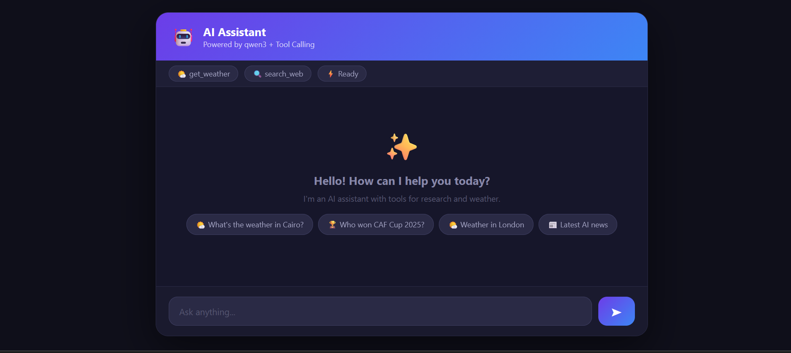

# Tool Calling API 🚀🤖

## Overview

A modern **AI Assistant** powered by **Groq** (Qwen3-32B model) with **tool calling** capabilities. Features a sleek **FastAPI backend** and **responsive frontend** built with vanilla HTML/CSS/JS.



### ✨ Key Features

- **Weather Tool**: Real-time weather via OpenWeatherMap API (`get_weather`)
- **Web Search Tool**: Internet search via DuckDuckGo (`search_web`)
- **Smart Tool Detection**: LLM automatically decides when to use tools
- **Conversation History**: Maintains context across messages
- **CORS Enabled**: Works with any frontend
- **Production Ready**: Easy deployment instructions

### 🛠 Tech Stack

```
Backend: FastAPI + Groq + Pydantic
Frontend: Vanilla HTML/CSS/JS (No frameworks)
Tools: OpenWeatherMap + DuckDuckGo Search
Deployment: Render + Vercel (Free)
```

## 🎯 Live Demo Capabilities

Try these examples:

```
🌤️ "What's the weather in Cairo?"
🔍 "Who won the CAF Cup 2025?"
🌤️ "Weather in London right now"
📰 "Latest AI news"
```

## 📁 Project Structure

```
ToolCalingProject/
├── main.py           # FastAPI backend + tool logic
├── requirements.txt  # Python dependencies
├── index.html        # Frontend UI (RTL Arabic support)
└── .gitignore        # Standard Python ignores
```

## 🚀 Quick Start (Local)

### 1. Install Dependencies

```bash
pip install -r requirements.txt
```

### 2. Get Free API Keys

- **Groq**: [console.groq.com](https://console.groq.com) → Create API Key
- **OpenWeather**: [openweathermap.org/api](https://openweathermap.org/api) → My API Keys

### 3. Create `.env`

```bash
GROQ_API_KEY=your_groq_key
OW_API_KEY=your_weather_key
```

### 4. Run Backend

```bash
uvicorn main:app --reload
```

Server runs at `http://localhost:8000`

### 5. Open Frontend

Open `index.html` in browser (Live Server recommended)

## 🔌 API Endpoints

| Endpoint      | Description     | Example                                       |
| ------------- | --------------- | --------------------------------------------- |
| `GET /`       | Health check    | `{"status": "Tool Calling API running 🚀"}`   |
| `GET /health` | Model info      | `{"status": "ok", "model": "qwen/qwen3-32b"}` |
| `POST /chat`  | Chat with tools | `{"message": "Weather in NYC"}`               |

### Chat Request Schema

```json
{
  "message": "What's the weather?",
  "history": [{ "role": "user", "content": "..." }]
}
```

### Chat Response Schema

```json
{
  "answer": "Final answer...",
  "tool_used": "get_weather",
  "tool_result": "Weather in NYC: Clear sky, 22°C..."
}
```

## 🧠 How Tool Calling Works

1. **User Message** → LLM (Qwen3-32B)
2. **LLM detects need** for tool → Outputs JSON: `{"tool": "get_weather", "params": {"city": "NYC"}}`
3. **Backend executes tool** → Gets weather data
4. **LLM generates final answer** using tool result
5. **Response** includes answer + tool info

**Tools Available:**
| Tool | Description | Parameters |
|------|-------------|------------|
| `get_weather` | Current weather | `city: string` |
| `search_web` | Web search | `query: string` |


### Backend (Render.com)

```
Build: pip install -r requirements.txt
Start: uvicorn main:app --host 0.0.0.0 --port $PORT
Env: GROQ_API_KEY, OW_API_KEY
```


## 📊 Dependencies

From `requirements.txt`:

```
fastapi==0.115.0      # API framework
uvicorn==0.30.6       # ASGI server
groq==0.11.0          # Groq LLM client
ddgs==9.11.4          # DuckDuckGo search
requests==2.32.3      # HTTP client
pydantic==2.9.2       # Data validation
python-dotenv==1.0.1  # Env variables
```

## 🎨 UI Features

- **Dark Theme** with gradients
- **RTL Support** (Arabic layout)
- **Typing Indicator**
- **Tool Usage Display**
- **Message Timestamps**
- **Smart Input Resize**
- **Suggestion Chips**
- **Smooth Animations**

## 🔒 Security & Production

✅ **CORS**: Configurable origins  
✅ **API Key Validation**: Required for chat  
✅ **Error Handling**: Comprehensive  
⚠️ **Production**: Restrict `allow_origins=["*"]`  
🔒 **Environment**: Never commit `.env`

## 🤝 Contributing

1. Fork the repo
2. Add new tools to `TOOLS` list in `main.py`
3. Update frontend suggestions in `index.html`
4. Test locally
5. Submit PR!

## 📄 License

MIT License - Free to use/modify/deploy anywhere.

---

**Built with ❤️ using FastAPI + Groq + Free APIs**  
**Ready for production in 5 minutes!**
